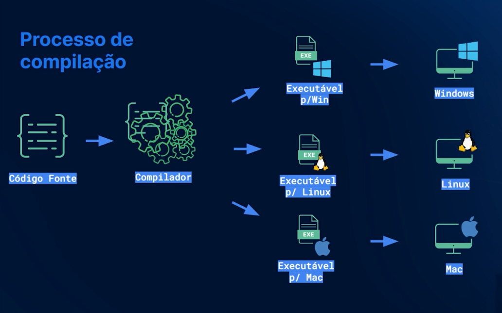
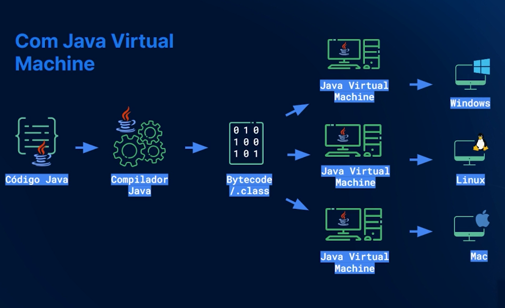

# DESVENDANDO O ARQUIVO .class

## Transcrição

Jacqueline: No painel à esquerda que exibe a estrutura de diretórios, observe que temos uma pasta chamada "out", que tem uma subpasta "primeiroprojeto" com um Main.

Se abrirmos esse arquivo Main, vai exibir o código de um Main.class. Esse class é o que ele vai executar. Além disso, ele está exibindo uma informação relacionada ao bytecode:

Decompiled .class file, bytecode version: 61.0 (Java 17)

Isso tem relação com o JVM (Java Virtual Machine).

Processos de compilação
Jacqueline: O código que estamos escrevendo, é uma linguagem de alto nível para o ser humano. Nós fazemos comandos que são inteligíveis para nós, é o que chamamos de código-fonte, o arquivo .java.

Mas a máquina não entende o que estamos escrevendo, é preciso ter uma transformação para que o nosso computador entenda aquelas instruções. Para isso, nós usamos um compilador.

Esse compilador vai preparar um executável para que nós possamos conversar com a máquina. Na maioria das linguagens compiladas é isso que vai acontecer.

Mas havia um problema com isso porque, quando compilávamos alguma coisa para o Windows, aquilo funcionava exclusivamente no Windows. Se tivesse outro sistema operacional como um Linux ou Mac, era preciso repetir o processo e fazer um outro executável para cada sistema.

Isso quebrava a ideia do Java, de rodar em qualquer lugar. O Java tem até o acrônimo WORA (Write Onde, Run Anywhere), ou seja, "Escreva uma vez e execute em qualquer lugar". Então, isso de ficar compilando para cada sistema operacional não funcionava.

Paulo: E se era preciso desenhar nas janelas do Linux o uso Windows, as bibliotecas eram diferentes. Pior ainda, o código-fonte teria que ser diferente.

Acho que isso tem um pouco a ver com a história. Muita gente fala "Poxa, meu código Python roda tanto no Windows quanto no Linux". E roda mesmo, o mecanismo de execução é diferente. O do Java tem muitas vantagens e, mais ainda, na época em que o Java nasceu com esse poder de compilar parcialmente numa linguagem intermediária que é executável para Windows e Linux, ele revolucionou na época.

Jacqueline: Exatamente. Ele colocou uma camada intermediária na qual pegamos o código Java, compila o código através do compilador Java e ele vai gerar esse arquivo que vimos, o .class, que é um Bytecode.

Paulo: Esse Bytecode é uma linguagem que nem o Windows entende, nem nós entendemos, porque se abrirmos esse arquivo, é um monte de hexadecimal.

Jacqueline: Sim. Então, nenhum desses sistemas operacionais vai conseguir entender o Bytecode. Mas existe alguém que vai conseguir entender: a máquina virtual Java.

Paulo: E a máquina virtual nada mais é do que um "computador de mentira", que compreende uma linguagem de máquina de mentira que o pessoal de Java chama de Bytecode, o código binário específico do Java.

Para essa linguagem intermediária do Bytecode .class, tanto faz o sistema operacional porque a JVM vai interpretar. Tem a JVM do Windows, tem a JVM do Linux. Por isso, quando baixamos a JVM no começo do curso, nós baixamos para o Windows.

Jacqueline: Então, o que fizemos e compilarmos, a JVM que se resolve para conversar com qualquer sistema operacional. Não precisamos nos preocupar, fazemos uma única compilação e existem várias distribuições de JVM, para a maioria dos sistemas operacionais, e elas se encarregam disso.

Esse é o nosso .class e a importância da JVM. O motivo para considerarmos a JVM uma plataforma. Não é só uma linguagem, um conjunto de comandos. Existe todo uma inteligência para facilitar a vida da pessoa desenvolvedora e aumentar a performance e a facilidade de distribuir o código.

Agora que já entendemos o processo de compilação, execução e o que é a JVM, vamos voltar ao código e começar a aprender a variáveis e outras coisas que precisamos saber para darmos continuidade.

Paulo: Lembrando que, se você está ouvindo algumas dessas palavras pela primeira vez: JVM, JDK, compilação, etc. Não se preocupe se você confundir as palavras, durante o curso vamos aprender com calma para que você aprenda o ecossistema Java.

Não queremos te ensinar apenas a escrever código, queremos que você tenha um entendimento um pouco mais profundo porque é isso que vai te diferenciar como profissional.